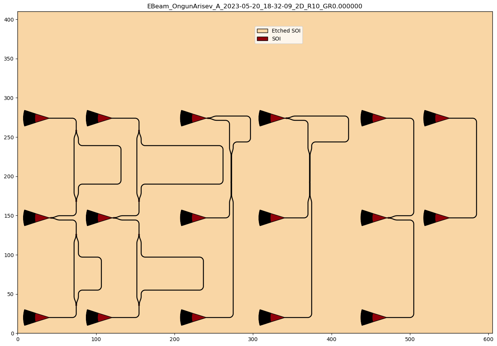
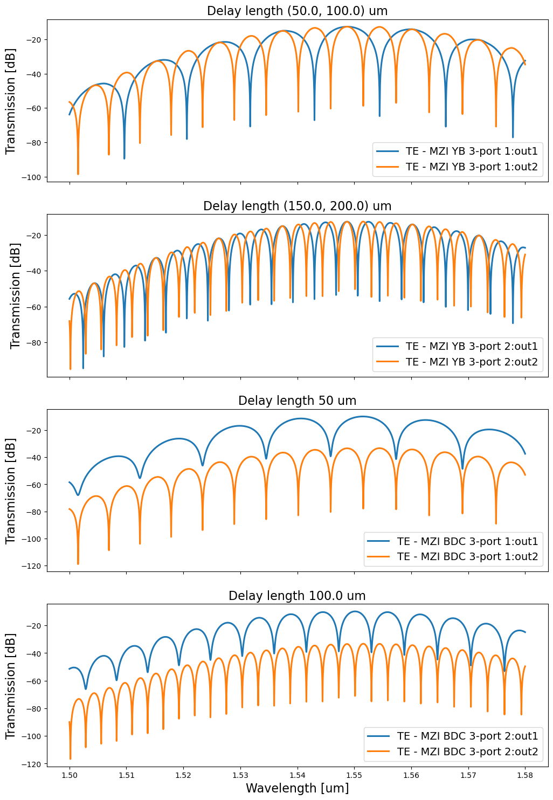
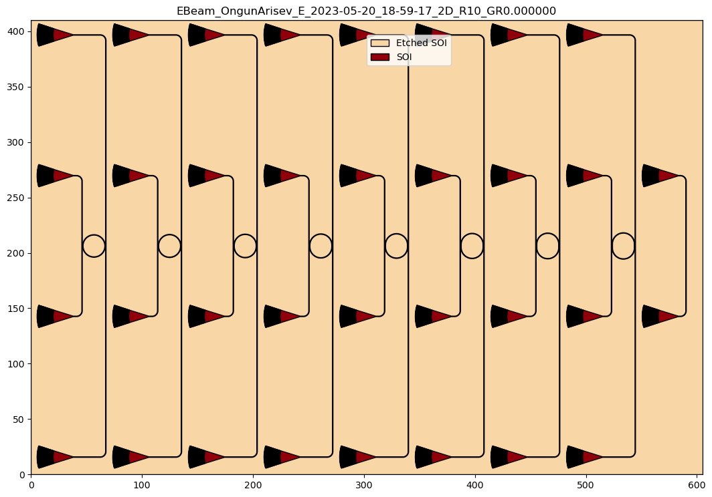
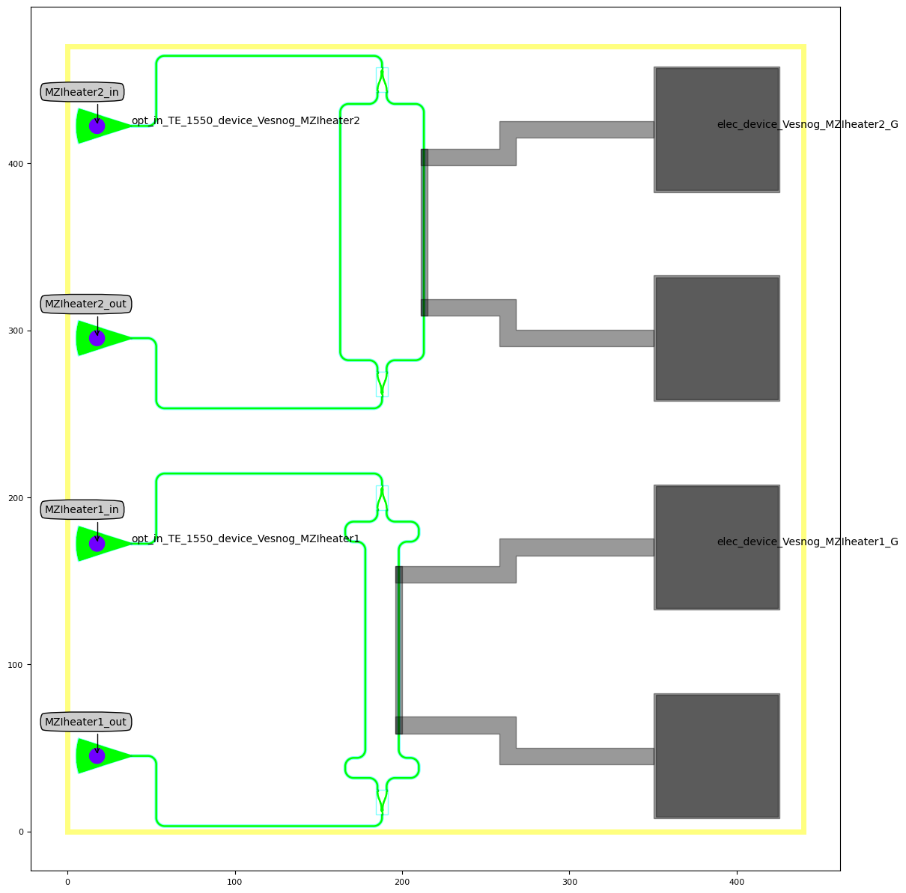
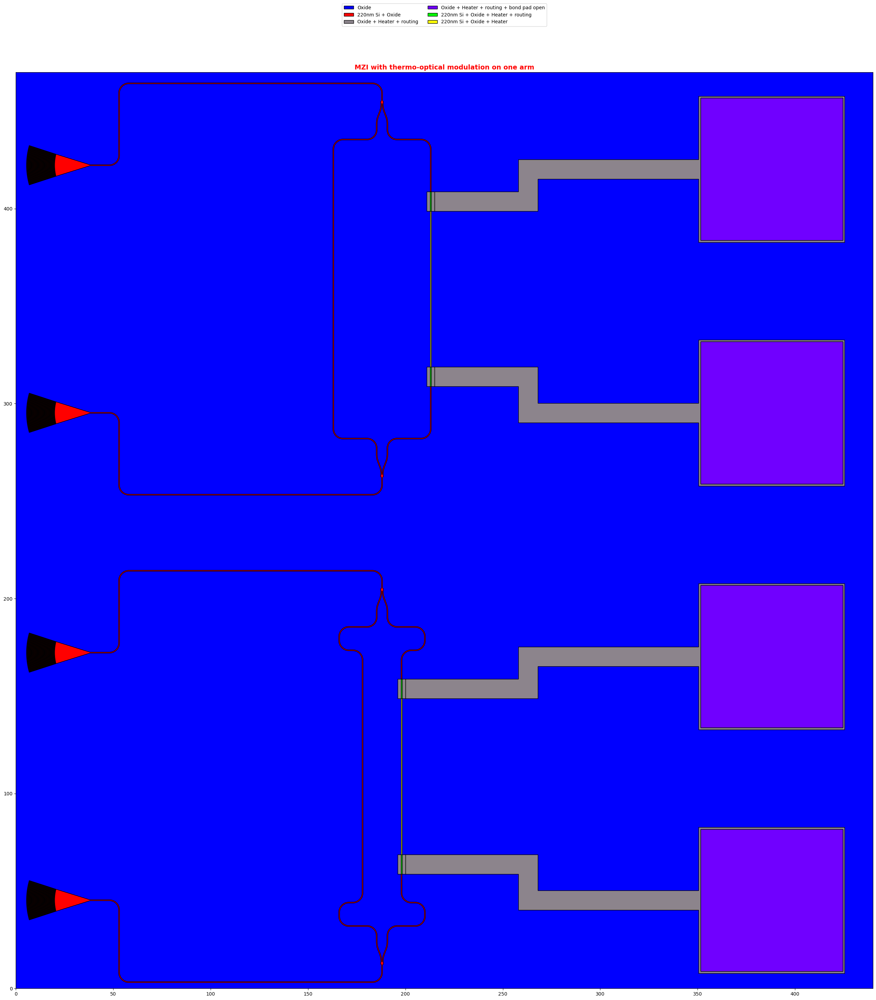

This is the repository containing my designs for the <a href="https://learning.edx.org/course/course-v1:UBCx+Phot1x+1T2023a/home"> Silicon Photonics Design, Fabrication and Data Analysis</a> course on EdX taught by by <a href="https://ca.linkedin.com/in/chrostowski">Lukas Chrostowski</a>  .

## Details:
 - The chips are manufactured via electron-beam lithography (EBL) at <a href="https://ebeam.mff.uw.edu/ebeamweb/index.html">Washington Nanofabrication Facility at the University of Washington, Seattle</a> 
 - For the mask design components available in the <a href="https://github.com/SiEPIC/SiEPIC_EBeam_PDK"> SiEPIC E-beam PDK</a> are used. 
 - Parametric design is done with the IPKISS photonics IC design software by <a href="https://www.lucedaphotonics.com/"> Luceda Photonics </a>.
 - The open-source software <a href="https://www.klayout.de/">KLayout </a> is used to review the mask design. 
 - The design approach taken here is <b>Layout-driven</b>, followed by verification, then a schematic (via a netlist extraction) and simulations.
 - Circuit simulations are done with Caphe included in IPKISS and Lumerical Interconnect available by <a href="https://www.ansys.com/products/photonics"> Ansys </a> 

